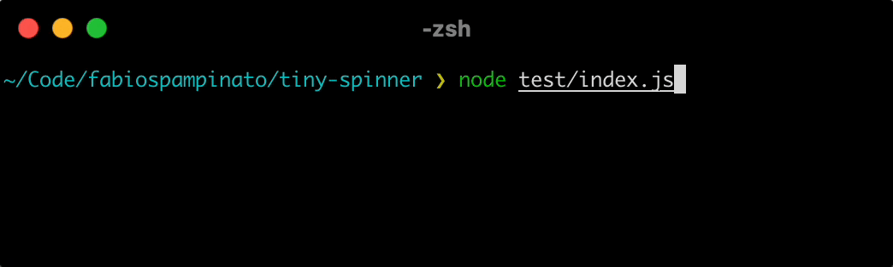

<p align="center">
  
</p>

# Tiny Spinner

A simple, yet beautiful, CLI spinner.

## Install

```sh
npm install --save tiny-spinner
```

## Usage

```ts
import Spinner from 'tiny-spinner';

// Create spinner

const spinner = new Spinner ();

// Start spinner with initial message

spinner.start ( 'Doing something' );

// Update message

spinner.update ( 'Still doing something' );

// Exit with a warning message

spinner.warning ( 'Some warning message' );

// Exit with an error message

spinner.error ( 'Some error message' );

// Exit with a success message

spinner.success ( 'Some success message' );

// Exit with a custom message (no prefix symbol)

spinner.stop ( 'Some stop message' );

// Exit without a message

spinner.stop ();
```

## License

MIT © Fabio Spampinato
